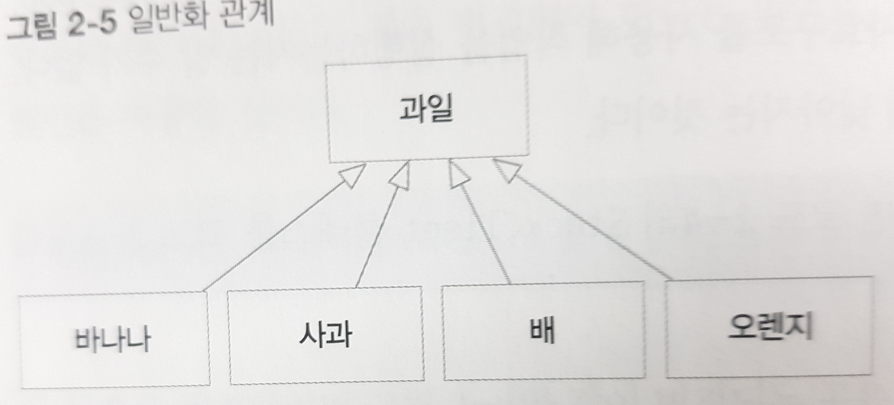
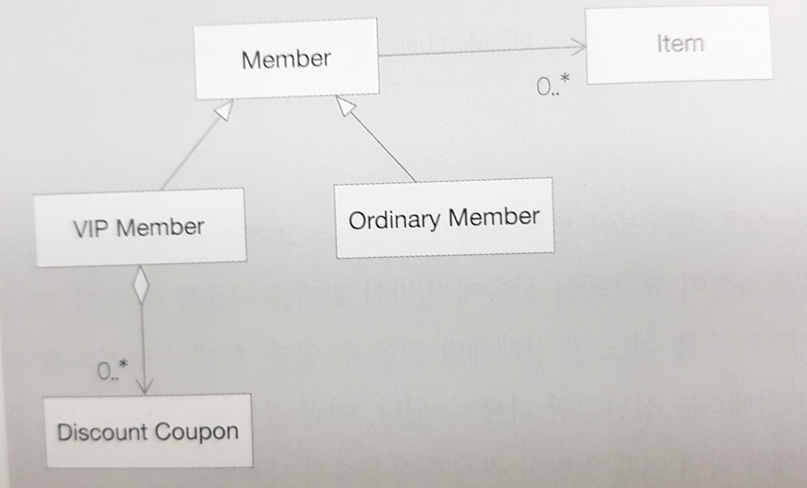
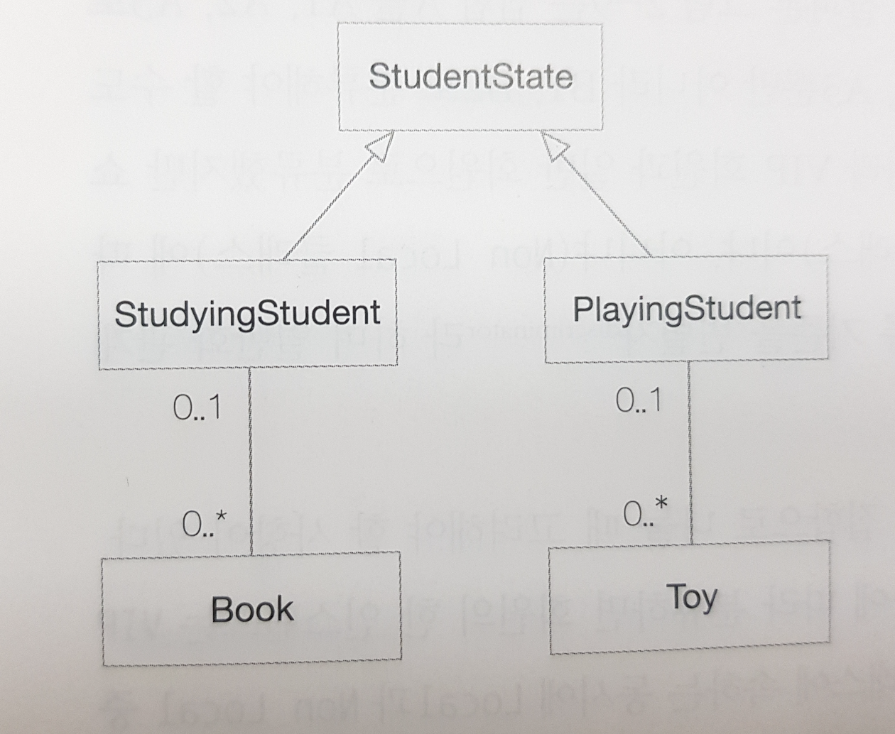
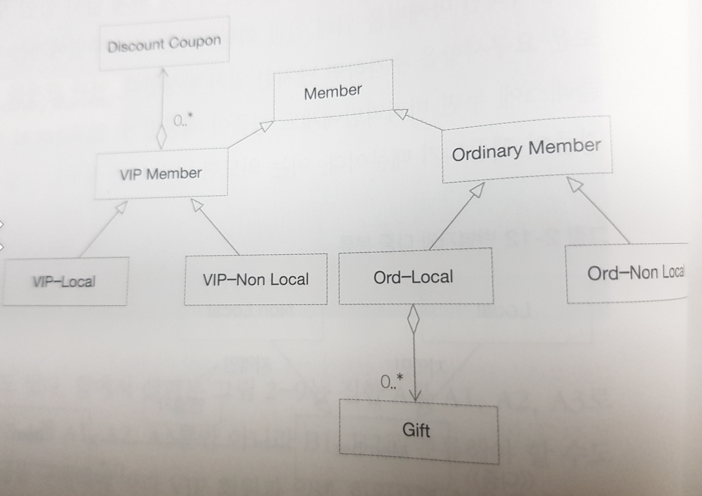
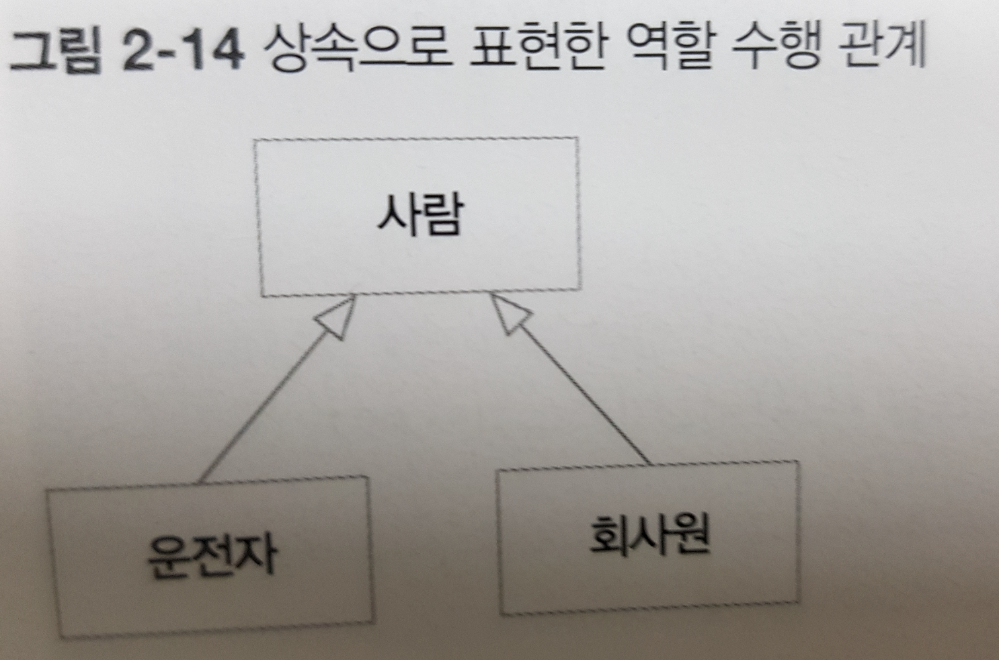
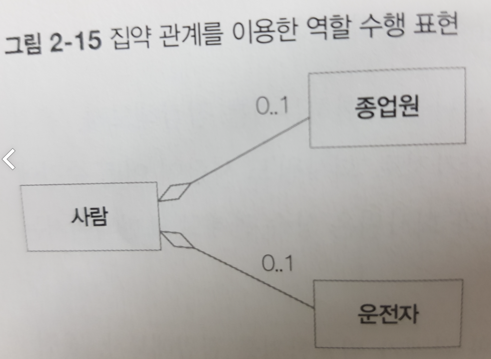
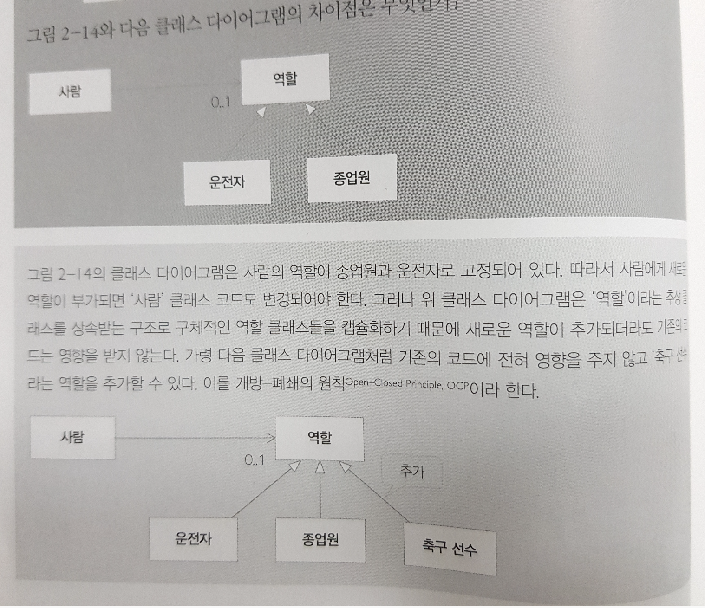
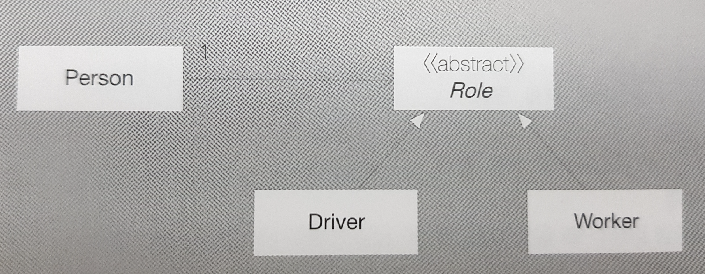

# [ 객체지향 원리]

[toc]


# 2.1 추상화

## 추상화란

 어떤 영역에서 필요로 하는 속성이나 행동을 추출하는 작업을 의미. 

# 2.2 캡슐화

## 요구사항의 변경

 요구사항 면경은 당연한 것. 

 요구사항 변경에 대처하는 고전적인 설계 원리

 - 응집도

   ```java
   클래스나 모듈 안의 요소들이 얼마나 밀접하게 관련되어 있는지
   ```

 - 결합도

   ```java
   어떤 기능을 실행하는 데 다른 클래스나 모듈들에 얼마나 의존적인지
   ```

 => **높은 응집도**와 **낮은 결합도** 를 유지해야 함. 


## 캡슐화의 필요성과 정보 은닉

 캡슐화는 특히 낮은 결합도를 유지할 수 있도록 해준다. 

 정보 은닉을 통해 높은 응집도와 낮은 결합도를 갖도록 한다. 

 - 정보 은닉이 필요한 이유

   ```java
   소프트웨어는 결합이 많을수록 문제가 많이 발생한다. 한 클래스가 변경이 발생하면 변경된 클래스의 비밀에 의존하는 다른 클래스들도 변경해야 할 가능성이 커진다.
   ```

 - 코드 2-4

   ```java
   package book.part2.code2_4;
   
   public class ArrayStack {
   
   	public int top;
   	public int[] itemArray;
   	public int stackSize;
   	
   	public ArrayStack(int stackSize) {
   		itemArray = new int[stackSize];
   		top = -1;
   		this.stackSize = stackSize;
   	}
   	
   	// 스택이 비어있는지 검사 
   	public boolean isEmpty() {
   		return (top == -1);
   	}
   	
   	// 스택이 꽉 차있는지 검사 
   	public boolean isFull() {
   		return (top == this.stackSize -1);
   	}
   	
   	// 스택에 아이템 추가 
   	public void push(int item) {
   		if(isFull()) {
   			System.out.println("Inserting fail! Array Stack is full!!");
   		} else {
   			itemArray[++top] = item;
   			System.out.println("Inserted Item : " + item);
   		}
   	}
   	
   	// 스택의 top에 있는 아이템 반환 
   	public int pop() {
   		if(isEmpty()) {
   			System.out.println("Deleting fail! Array Stack is empty!");
   			return -1;
   		} else {
   			return itemArray[top--];
   		}
   	}
   	
   	public int peek() {
   		if(isEmpty()) {
   			System.out.println("Peeking fail! Array Stack is empty!");
   			return -1;
   		} else {
   			return itemArray[top];
   		}
   	}
   }
   
   ```

   ```java
   package book.part2.code2_4;
   
   public class StackClient {
   
   	public static void main(String[] args) {
   		// 길이 10의 Array Stack 으로 초기화 
   		ArrayStack st = new ArrayStack(10);
   		
   		// 0번지값에 20 할당 
   		st.itemArray[++st.top] = 20;
   		
   		// 가장 최근에 들어간 데이터의 인덱스(st.top)에 위치한 값(st.itemArray) 출력 
   		System.out.println(st.itemArray[st.top]);
   		
   	}
   }
   ```

   

   => 자료구조에 모두 public 접근제한자를 붙여 외부에 공개됨. 즉, StackClient 클래스처럼 push 메서드나 pop 메서드를 사용하지 않고 직접 배열에 값 저장 가능. 이런 경우 ArrayStack과 StackClient 클래스간 강한 결합이 발생. 

   => ArrayList 클래스를 사용해 스택 구현이 변경되면 StackClient 클래스도 따라서 변경되어야 하는데, 이는 StackClient 클래스가 은닉된 정보를 직접 사용했기 때문. 

   ```java
   ArrayListStack st = new ArrayListStack(10);
   // 이런식으로 client도 변경되어야 하는 번거로움 발생 
   ```

   

## 바람직한 정보 은닉

- 멤버변수를 private으로 은닉한다.
- 지금부터는 push, pop, peek 메서드의 연산으로만 스택 사용 가능. 스택과 이를 사용하는 코드의 결합이 낮아진다. 


# 2.3 일반화 관계

### 2.3.1 일반화는 또 다른 캡슐화

일반화 : 여러 개체들이 가진 공통된 특성을 부각시켜 하나의 개념이나 법칙으로 성립하는 과정



ex) "과일"로 일반화 시키면서 새로운 과일이 추가되더라도 코드를 수정할 필요가 없도록

```java
int computeTotalPrice(LinkedList<Fruit> f){
  int total = 0;
  Iterator<Fruit> itr = f.iterator();
  
  while(itr.hasNext()){
    Fruit curFruit = itr.next();
    total = total + curFruit.calculatePrice();
    // calculatePrice는 과일 종류에 따라 다르게 실행됨. 다형성을 따른것. 
  }
  return total;
}
```

=> 외부 세계에 자식 클래스를 캡슐화(은닉)하는 개념. 

이 때 캡슐화 개념은 한 클래스 안에 있는 속성 및 연산들의 캡슐화에 한정되지 않고 일반화 관계를 통해 클래스 자체를 캡슐화하는 것으로 확장됨. 

이러한 서브 클래스의 캡슐화는 외부 클라이언트가 개별적인 클래스들과 무관하게 프로그래밍을 할 수 있게 함. 


### 2.3.2 일반화 관계와 위임 

- 일반화 관계는 "is a kind of" 관계가 성립되어야 한다. 

- 두 자식 클래스 사이에 "is a kind of 관계"가 성립되지 않을 때 상속을 사용하면 오히려 불필요한 속성이나 연산을 물려받게 된다. 

- **위임** : 어떤 클래스의 일부 기능만 재사용하고 싶은 경우 사용. 자신이 직접 기능을 실행하지 않고 다른 클래스의 객체가 기능을 실행하도록 위임하는 것. 일반화 관계는 클래스 사이의 관계, 위임은 객체 사이의 관계. 

- 위임을 사용해 일반화(상속)을 대신하는 과정

  1. 자식 클래스에 부모 클래스의 인스턴스를 참조하는 속성을 만든다. 이 속성 필드를 this로 초기화한다.
  2. 서브 클래스에 정의된 각 메서드에 1번에서 만든 위임 속성 필드를 참조하도록 변경한다.
  3. 서브 클래스에서 일반화 관계 선언을 제거하고 위임 속성 필드에 슈퍼 클래스의 객체를 생성해 대입한다.
  4. 서브 클래스에서 사용된 슈퍼 클래스의 메서드에도 위임 메서드를 추가한다.
  5. 컴파일하고 잘 동작하는지 확인한다. 

  ```java
  public class MyStack<String> extends ArrayList<String> {
    private ArrayList<String> arList = new ArrayList<String>();
    
    // 부모의 메소드들중에 원하는것만 사용 가능 
    public void push(String element){
      arList.add(element);
    }
    
    public String pop() {
      return arList.remove(arList.size() - 1);
    }
    
    public boolean isEmpty() {
      return arList.isEmpty();
    }
    
    public int size() {
      return arList.size();
    }
  }
  ```

  :star: 기능을 재사용할때는 위임을 이용하라.


### 2.3.3 집합론 관점으로 본 일반화 관계

수학의 집합론 관점에서 일반화 관계를 만들면 연관 관계를 단순하게 할 수 있다.

- ex) 쇼핑몰에서 구매액을 기준으로 회원을 vip와 일반회원으로 분류. Item 클래스와 어떻게 연관관계를 맺어야 할까?

  

  => 회원 등급과 상관없이 물품을 구매할 수 있으므로 부모 클래스인 회원 클래스와 연관관계를 맺는게 맞음.

집합론적 관계에서 상호 배타적인 특성이 요구되는 상황에 일반화 관계를 적용할 수 있다.

- ex) 학생은 '놀기'와 '공부하기'중 어느 한 상태에만 있을 수 있다. 학생이 '공부하기' 상태라면 책만 볼 수 있고, '놀기' 상태라면 장난감만 다룰 수 있다. 이런 경우 상호 배타적인 두 상태를 모델링해야하고 이떄 일반화 관계가 유용하게 사용된다.

  

- **특수화** : 일반화의 역관계. 부모 클래스에서 자식 클래스를 추출하는 과정. 특수화가 필요한 경우는 어떤 속성이나 연관 관계가 특정 자식 클래스에서만 관련이 있고 다른 자식 클래스에서는 관련이 없는 경우.

- **변별자** : 집합을 분류하는 기준. vip 회원인지 아닌지는 구매액이 결정, 지역 주민인지 아닌지는 사는 지역이 결정. 

- **다중분류** : 한 인스턴스가 동시에 여러 클래스에 속할 수 있는 것. ex) vip 회원이면서 지역주민. <<다중>> 스테레오 타입을 사용해 표현. 

  > 다중분류를 처리하는 방법중 하나 : 모든 분류 가능한 조합에 대응하는 클래스를 만드는 방법
  >
  > 
  >
  > => vip-local, vip-non local, ord-local, odd-non local 이렇게 모든 가능한 분류를 클래스로 정의했다.

- :star: 일반화는 자식 클래스들의 적절한 합집합과 교집합으로 이뤄진다.


## 2.4 다형성

- **다형성** :서로 다른 클래스의 객체가 같은 메시지를 받았을 때 각자의 방식으로 동작하는 능력. 다형성은 일반화 관계와 함께 자식 클래스를 개별적으로 다룰 필요 없이 한 번에 처리할 수 있게 하는 수단을 제공한다. 

```java
public abstract class Pet {
  public abstract void talk();
}

public class Cat extends Pet {
  public void talk() {
    System.out.println("야옹");
  }
}

public class Dog extends Pet {
  public void talk() {
    System.out.println("멍멍");
  }
}

Pet p = new Dog();
```

=> 다형성을 사용하지 않는 경우 클래스별로 다르게 처리해줘야 하지만 다형성을 사용하는 경우 구체적으로 현재 어떤 클래스 객체가 참조되는지와 무관하게 프로그래밍을 할 수 있다. 이것이 가능한 이유는 일반화 관계에 있을 때 부모 클래스의 참조 변수가 자식 클래스의 객체를 참조할 수 있기 때문. 


### 체크포인트(p.85)

```java
package book.part2.p85;

public class A {

	public static void doIt() {
		System.out.println("doIt: A class method");
	}
	
	public void doThat() {
		System.out.println("doThat: A class method");
	}
	
}

```

```java
package book.part2.p85;

public class A1 extends A {

	public static void doIt() {
		System.out.println("doIt: A1 class method");
	}
	
	public void doThat() {
		System.out.println("doThat: A1 method");
	}
}
```

```java
package book.part2.p85;

public class main {

	public static void main(String[] args) {
		A a1 = new A1();
		A1 a2 = new A1();
		
		// A method가 호출됨. static이기떄문. 오버라이딩은 주로 객체와 연관되어 같은 부모를 참조하지만 선언된 객체의 자식 클래스에 따라 서로 다른 메소드를 호출한다.
		// static은 자식객체가 아니라 참조하고있는 값과 연관되있기 때문에 참조하고있는 부모가 가진 메소드를 출력.
    // 책 설명 : static 메서드(정적 메서드)를 실행할때 동적 바인딩을 실행하는 것이 아니고 컴파일할 때 결정된 객체의 타입에 따라 실행될 메서드가 결정됨.
		a1.doIt();
		
		// A1 method가 호출됨. non-static
		a1.doThat();
		
		// A1 method가 호출됨. 애초에 A1의 객체였기 때문. 
		a2.doIt();
	}
}

```


## 2.5 피터 코드의 상속 규칙

상속의 오용을 막기 위해 상속 사용을 제한하는 규칙. 하나라도 만족하지 않으면 상속을 사용해선 안된다.

> - 자식 클래스와 부모 클래스 사이는 '역할 수행' 관계가 아니어야한다.
> - 한 클래스의 인스턴스는 다른 서브 클래스의 객체로 변환할 필요가 절대 없어야 한다.
> - 자식 클래스가 부모 클래스의 책임을 무시하거나 재정의하지 않고 확장만 수행해야 한다.
> - 자식 클래스가 단지 일부 기능을 재사용할 목적으로 유틸리티 역할을 수행하는 클래스를 상속하지 않아야 한다.
> - 자식 클래스가 '역할', '트랜잭션', '디바이스' 등을 특수화 해야한다. 

ex) 다음의 클래스 다이어그램은 피터 코드의 법칙에 위배되지 않는가?



1. '운전자'와 '사람'은 어느 순간에 '사람'이 수행하는 역할중 하나. 위배된다.
2. '운전자'는 어느 시점에 '회사원'이 될 필요가 있으며 그 반대의 경우도 마찬가지. 회사까지 운전하고 가는길은 운전자였지만 회사에선 회사원이니 자식 클래스의 인스턴스들 사이에 변환 관계가 필요하게됨. 위배된다.
3. 점검할 수 없다. 클래스들에 어떤 속성과 연산이 정의되었는지 정보가 없기떄문. 
4. 기능만 재사용할 목적으로 상속 관계를 표현하지는 않았으므로 규칙을 준수한다.
5. 슈퍼 클래스가 역할, 트랜잭션, 디바이스를 표한하지 않았으므로 규칙에 위배된다.


=> 집약관계를 통해 클래스 사이 관계를 표현하는게 더 낫다. 이렇게 설계하면 사람은 회사원, 운전자 역할을 수행하고, 어느 순간에는 두 역할도 수행하지 않을 수 있다는 다중성도 표현할 수 있다.




### 개방-폐쇄의 원칙




### 체크포인트

회사에 도착했을때 운잔자에서 종업원으로 역할이 변경되어 회사에서 업무를 수행하는 상황을 코드로 작성하라.



```java
public class Person {
  private Role r;
  public void setRole(Role r){
    this.r = r;
  }
  
  public Role getRole() {
    return this.r;
  }
  
  public void doIt() {
    r.doIt();
  }
}

```

```java
public abstract class Role {
  public abstract void doIt();
}
```


```java
public class Driver extends Role {
  public void doIt() {
    System.out.println("Driving");
  }
}
```

```java
public class Worker extends Role {
  public void doIt() {
    System.out.println("Working");
  }
}
```

```java
public class Main() {
  public static void main(String[] args){
    Person p = new Person();
    p.setRole(new Driver()); // 운전자로 역할 변경
    p.doIt(); // 운전자 역할 수행
    p.setRole(new Worker())(); // 종업원으로 역할 변경
    p.doIt(); // 종업원 역할 수행 
  }
}
```

