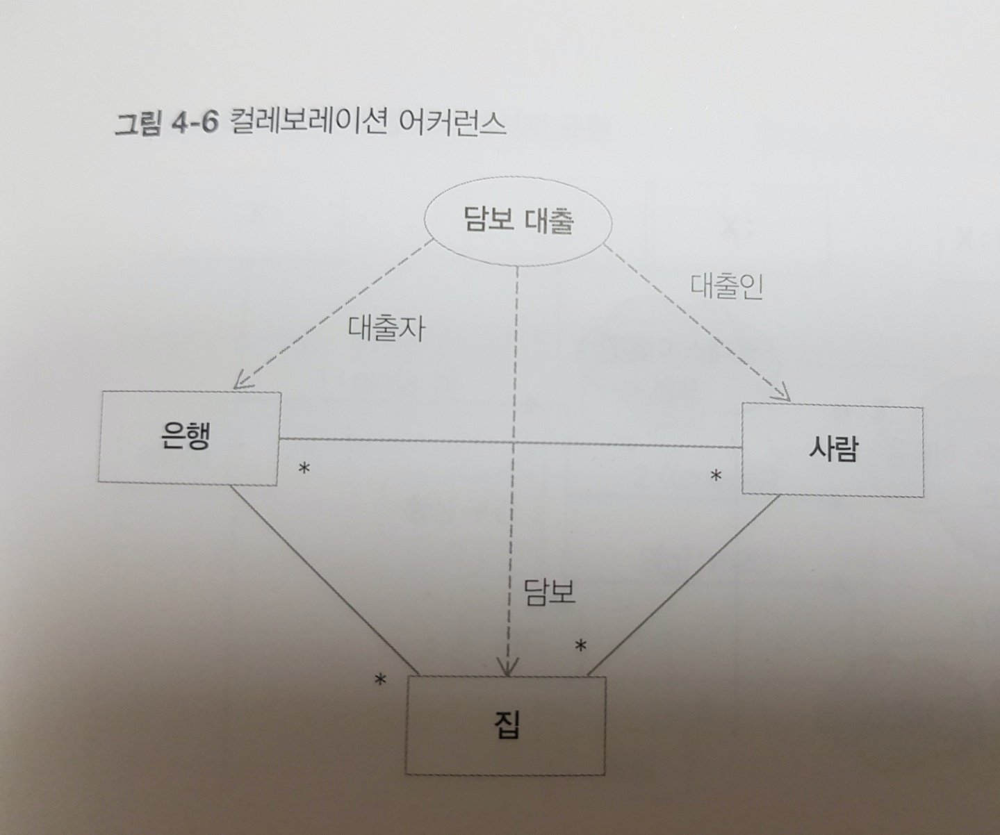
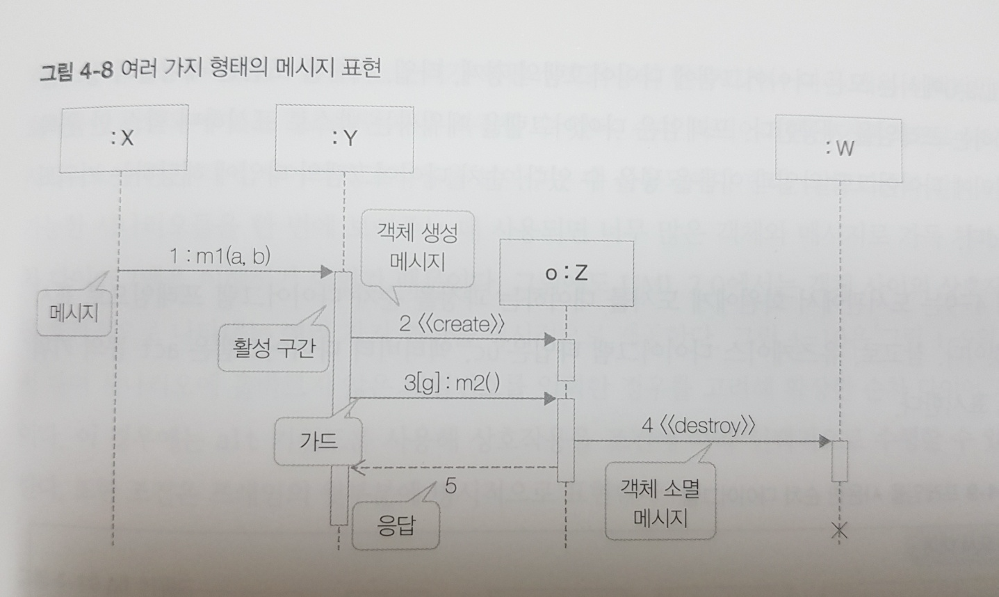

# [ 디자인 패턴 ]

[toc]


# 4.1 디자인 패턴의 이해

## 디자인 패턴이란?

클래스/객체의 구조와 협업 방법을 패턴화한 것.

소프트웨어를 설계할 때 특정 맥락에서 자주 발생하는 고질적인 문제들이 또 발생했을 때 자사용할 수 있는 훌륭한 해결책. 

```
"바퀴를 다시 발경하지 마라."
불필요하게 처음부터 다시 시작하지 말라는 것.
자동차를 설계하는 경우 바퀴는 이미 오래 전에 발명되어 잘 굴러가는데 처음부터 다시 바퀴를 발명하겠다고 하는것은 불필요한 일.
```

- 패턴 : 패턴은 비슷하거나 동일한 양식 또는 유형들이 반복되어 나타난다는 의미이며, 문제와 해결책도 동일한 유형이나 양식을 통해 쉽게 찾을 수 있다.


## 디자인 패턴의 구조

1. 콘텍스트 : 문제가 발생하는 여러 생황을 기술. 즉, 패턴이 적용될 수 있는 상황.
2. 문제 : 패턴이 적용되어 해결될 필요가 있는 여러 디자인 이슈들을 기술.
3. 해결 : 문제를 해결하도록 설계를 구성하는 요소들과 그 요소들 사이의 관계, 책임, 협력 관계를 기술.


## 디자인 패턴의 필요성

- 콘텍스트 - 문제 - 해결로 구성된 패턴 구조만으로는 같은 문제이지만 다른 상황에서 발생하는 모든 비슷한 문제들을 설명할 수 없다. 
- 자주 발생하는 문제들을 하나의 '패턴'으로 정의하고 콘텍스트에 맞게 적절한 해결을 한다면 더 효율적이다.
- ex) 어떤 클래스의 객체를 반드시 하나만 생성하도록 클래스를 설계하는 방법을 논할때, '싱글턴' 패턴을 활용하는것을 '해결'로 한다면 팀원 사이의 의사소통을 원활하게 할 수 있다.


# 4.2 GoF 디자인 패턴

## GoF(Gang of Four) 란?

- 에리히 감마, 리차드 헬름, 랄프 존슨, 존 블리시디스 네 명을 뜻함. 소프트웨어 개발 영역에서 디자인 패턴을 구체화하고 체계화한 사람들.


## GoF 디자인 패턴의 분류

|          | 생성 패턴                                                    | 구조 패턴                                                    | 행위 패턴                                                    |
| -------- | ------------------------------------------------------------ | ------------------------------------------------------------ | ------------------------------------------------------------ |
| 패턴이름 | 추상팩터리<br />빌더<br />팩토리 메소드<br />프로토타입<br />싱글턴 | 어댑터<br />브릿지<br />컴퍼지트<br />데커레이터<br />퍼사드<br />플라이웨이트<br />프록시 | 책임 연쇄<br />커맨드<br />인터프리터<br />이터레이터<br />미디에이터<br />메멘토<br />옵서버<br />스테이트<br />스트래티지<br />템플릿 메서드<br />비지터 |

- 생성 패턴 

  객체 생성과 관련된 패턴. 객체의 생성과 조합을 캡슐화해 특정 개체가 생성되거나 변경되어도 프로그램 구조에 영향을 크게 받지 않도록 유연성을 제공.

- 구조 패턴

  클래스나 객체를 조합해 더 큰 구조를 만드는 패턴. 예를 들어 서로 다른 인터페이스를 지닌 2개의 객체를 묶어 단일 인터페이스를 제공하거나 객체들을 서로 묶어 새로운 기능을 제공하는 패턴

- 행위 패턴

  객체나 클래스 사이의 알고리즘이나 책임 분배에 관련된 패턴. 가령 한 객체가 혼자 수행할 수 없는 작업을 여러 개의 객체로 어떻게 분배하는지, 또 그렇게 하면서도 객체 사이의 결합도를 최소화하는 것에 중점을 둠.


# 4.3 UML과 디자인 패턴

## 4.3.1 컬레보레이션

### 객체와 역할

- 어떤 주어진 목적을 달성하려고 여러 객체가 각자 자신이 맡은 역할에 따라 일을 수행하며 서로 협력한다. 

- 객체는 역할이 아니므로 한 객체가 여러 역할을 수행할 수 있다.

  ex) 홍길동씨는 집에선 아빠, 회사에선 프로그래머, 주말 축구 동호회에서는 총무 역할을 수행함. 

  집에서 아빠 역할을 수행할 때 회사 업무를 수행할 때 필요한 기능들이 요구되지 않음.

- 디자인 패턴 역시 목적을 달성하기 위한 역할들의 상호 협동 작업이다. 

- UML에서는 객체들이 특정 상황에서 수행하는 역할의 상호작용을 컬레보레이션이라는 요소로 작성한다.


### 컬레보레이션 예


### 컬레보레이션 어커런스

- 더 구체적인 상황에서의 컬레보레이션 적용을 표현




## 4.3.2 순차 다이어그램

### 순차 다이어그램이란?

- 객체들 사이의 메세지 송진과 그들의 순서를 나타냄. 
- 객체는 가장 윗부분에 표현, 왼쪽에서 오른쪽으로 객체들을 나열.
- '객체 이름: 클래스 이름' 형식 이용
- 생명선 : 객체 아래에 뻗어가는 점선. 해당 객체가 존재함을 보여줌. 
- 활성 구간 : 생명선을 따라 나오는 좁고 긴 사각형. 실제로 객체가 연산을 실행하는 상태임을 보여줌.
- 객체 사이의 메세지는 화살표로 표시. 
- <<create>> 메세지 : 객체를 생성하는 메세지
- <<destroy>> 메세지 : 객체를 소멸시키는 메세지




