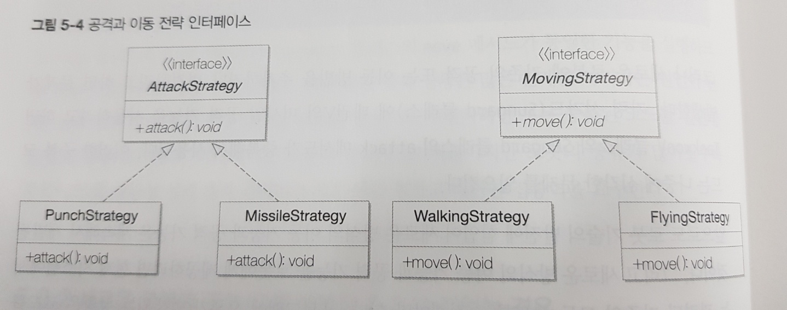
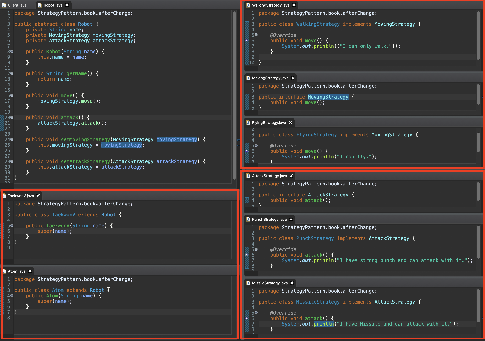

# [ 스트래티지 패턴 ]

[toc]


# 5.1 로봇만들기

- 로봇에는 태권브이와 아톰이 있고, 각각 공격과 이동 기능이 있다. 태권브이는 걸으며 미사일을 발사하고 아톰은 날으며 펀치를 날릴 수 있다. 

## Robot 클래스

```java
package StrategyPattern.book;

public abstract class Robot {
	
	private String name;
	
	public Robot(String name) {
		this.name = name;
	}
	
	public String getName() {
		return name;
	}
	
	public abstract void attach();
	public abstract void move();
}

```


## TaekwonV 클래스

```java
package StrategyPattern.book;

public class TaekwonV extends Robot {

	public TaekwonV(String name) {
		super(name);
	}
	
	@Override
	public void attach() {
		System.out.println("I have Missile and can attack with it.");
	}

	@Override
	public void move() {
		System.out.println("I can only walk.");
	}

}

```


## Atom 클래스

```java
package StrategyPattern.book;

public class Atom extends Robot {

	public Atom(String name) {
		super(name);
	}
	
	@Override
	public void attach() {
		System.out.println("I have strong punch and can attack with it.");
	}

	@Override
	public void move() {
		System.out.println("I can fly.");
	}

}

```


## Client 클래스

```java
package StrategyPattern.book;

public class Client {

	public static void main(String[] args) {
		// 묵시적 형변환으로 태권브이, 아톰 객체 생성 
		Robot taekwonV = new TaekwonV("TaekwonV");
		Robot atom = new Atom("Atom");
		
		System.out.println("My name is " + taekwonV.getName());
		taekwonV.move();
		taekwonV.attach();
		
		System.out.println();
		
		System.out.println("My name is " + atom.getName());
		atom.move();
		atom.attach();
	}
}

```


## 실행 결과

```
My name is TaekwonV
I can only walk.
I have Missile and can attack with it.

My name is Atom
I can fly.
I have strong punch and can attack with it.
```


# 5.2 문제점

- 기존 로봇의 공격 또는 이동 방법을 수정하려면 어떤 변경 작업을 해야하는가? 예를 들어 아톰이 날 수 없고 오직 걷게만 만들고싶다면? 또는 태권브이를 날게 하려면?
- 새로운 로봇을 만들어 기존의 공격 또는 이동 방법을 추가하거나 수정하려면? 예를 들어 지구의 용사 선가드 클래스를 만들어 태권브이의 미사일 공격 기능을 추가하려면?


## 5.2.1 기존 로봇의 공격과 이동 방법을 수정하는 경우

- 만약 아톰이 날 수 없고 오직 걷게만 하고싶다면 위의 코드로는 Atom 클래스의 move 메소드를 수정해야한다.

```java
package StrategyPattern.book;

public class Atom extends Robot {

	public Atom(String name) {
		super(name);
	}
	
	@Override
	public void attach() {
		System.out.println("I have strong punch and can attack with it.");
	}

	@Override
	public void move() {
    ///////////////// 변경된 부분 /////////////////
		System.out.println("I can only walk.");
	}

}
```

- 이는 새로운 기능으로 변경하려고 기존 코드의 내용을 수정해야하므로 <u>OCP에 위배</u>된다. 
- 또한 Atom 클래스의 move 메소드와 TaekwonV 클래스의 move <u>메소드가 중복</u>된다.
- 중복 상황은 많은 문제를 야기하는 원인이 된다. 로봇 종류가 많아질수록 중복 코드를 일관성있게 유지하는 일은 매우 힘들다.


## 5.2.2 새로운 로봇에 공격/이동 방법을 추가/수정하는 경우

- 현재 설계는 로봇 자체가 캡슐화 단위이므로 새로운 로봇 추가가 쉽다.
- 그러나 새로운 로봇에 기존의 공격 또는 이동 방법을 추가하거나 변경하려고 하면 문제가 발생한다. 만약 선가드 로봇에 태권브이의 미사일 공격 기능을 사용하려고 하면 TaekwonV 클래스와 선가드 클래스의 attack <u>메소드가 중복</u>된다. 


# 5.3 해결책

- :star: **무엇이 변화되었는지 찾고, 변화된 것을 클래스로 캡슐화해야한다.**
- 로봇 예제에서 변화되면서 문제를 일으키는건 로봇의 <u>이동 방식</u>과 <u>공격 방식의 변화</u>다.
- 이를 캡슐화하려면 외부에서 구체적인 이동 방식과 공격 방식을 담은 구체적인 클래스들을 은닉해야한다. 
- 이를 위해 공격, 이동을 위한 인터페이스를 각각 만들고, 이들을 실제 실현한 클래스를 만들어야한다.




- Robot 클래스 입장에서 구체적인 이동 방식과 공격 방식이 MovingStrategy와 AttackStrategy 인터페이스에 의해 캡슐화되어있다. 따라서 이들 기능을 이용하는 로봇 객체와는 상관없이 향후 등장할 이동 방식과 공격 방식의 변화뿐만 아니라 현재 변화도 잘 처리할 수 있게 된다. 
- 예를 들어 punch, missile 뿐만아니라 kick 이라는 공격 방식이 개발되어 현재 로봇에 제공하더라도 AttackStrategy 인터페이스가 변화에 대한 일종의 방화벽 역할을 수행해 Robot 클래스의 변경을 차단해준다. 즉, 새로운 기능의 추가(새로운 공격 기능)가 기존의 코드에 영향을 미치지 못하게 하므로 OCP를 만족하는 설계가 된다. 
- 변경된 새로운 구조에서는 외부에서 로봇 객체의 이동 방식과 공격 방식을 임의대로 바꾸도록 해주는 메소드가 필요하고, 이를 위해 Robot 클래스에 setMovingStrategy와 setAttackStrategy 메소드로 로봇의 이동 방식과 공격 방식이 필요할 때 바꿀 수 있도록 했다.
- 이런 변경이 가능한 이유는 상속 대신 집약 관계를 이용했기 때문.(두 인터페이스를 Robot이 상속한게 아니라 외부에서 두 인터페이스 객체를 만들고 Robot 클래스에서는 이 객체를 set해주기만 함)


< 수정된 코드 >

## Robot

```java
package StrategyPattern.book.afterChange;

public abstract class Robot {
	private String name;
	private MovingStrategy movingStrategy;
	private AttackStrategy attackStrategy;
	
	public Robot(String name) {
		this.name = name;
	}
	
	public String getName() {
		return name;
	}
	
	public void move() {
		movingStrategy.move();
	}
	
	public void attack() {
		attackStrategy.attack();
	}
	
	public void setMovingStrategy(MovingStrategy movingStrategy) {
		this.movingStrategy = movingStrategy;
	}
	
	public void setAttackStrategy(AttackStrategy attackStrategy) {
		this.attackStrategy = attackStrategy;
	}
}

```


## Atom

```java
package StrategyPattern.book.afterChange;

public class Atom extends Robot {
	public Atom(String name) {
		super(name);
	}
}
```


## TaekwonV

```java
package StrategyPattern.book.afterChange;

public class TaekwonV extends Robot {

	public TaekwonV(String name) {
		super(name);
	}
}
```


## MovingStrategy (interface)

```java
package StrategyPattern.book.afterChange;

public interface MovingStrategy {
	public void move();
}
```


## FlyingStrategy

```java
package StrategyPattern.book.afterChange;

public class FlyingStrategy implements MovingStrategy {

	@Override
	public void move() {
		System.out.println("I can fly.");
	}

}
```


## WalkingStrategy

```java
package StrategyPattern.book.afterChange;

public class WalkingStrategy implements MovingStrategy {

	@Override
	public void move() {
		System.out.println(("I can only walk."));
	}

}
```


## AttackStrategy (interface)

```java
package StrategyPattern.book.afterChange;

public interface AttackStrategy {
	public void attack();
}
```


## MissileStrategy

```java
package StrategyPattern.book.afterChange;

public class MissileStrategy implements AttackStrategy {

	@Override
	public void attack() {
		System.out.println("I have Missile and can attack with it.");
	}

}
```


## PunchStrategy

```java
package StrategyPattern.book.afterChange;

public class PunchStrategy implements AttackStrategy {

	@Override
	public void attack() {
		System.out.println("I have strong punch and can attack with it.");
	}

}
```


## Client

```java
package StrategyPattern.book.afterChange;

public class Client {
	public static void main(String[] args) {
		Robot taekwonV = new TaekwonV("TaekwonV");
		Robot atom = new Atom("Atom");
		
		// new WalkingStrategy가 들어가면서 MovingStrategy 인터페이스에서 자식클래스인 WalkingStrategy로 묵시적 형변환 
		taekwonV.setMovingStrategy(new WalkingStrategy());
		taekwonV.setAttackStrategy(new MissileStrategy());
		
		atom.setMovingStrategy(new FlyingStrategy());
		atom.setAttackStrategy(new PunchStrategy());
		
		System.out.println("My name is " + taekwonV.getName());
		taekwonV.move();
		taekwonV.attack();
		
		System.out.println();
		
		System.out.println("My name is " + atom.getName());
		atom.move();
		atom.attack();
	}
}
```





## 새로운 로봇을 추가하고싶다면

### Sungard 

```java
package StrategyPattern.book.afterChange;

public class Sunguard extends Robot {
	
	public Sunguard(String name) {
		super(name);
	}
}
```


### Client

```java
package StrategyPattern.book.afterChange;

public class Client {
	public static void main(String[] args) {
		Robot taekwonV = new TaekwonV("TaekwonV");
		Robot atom = new Atom("Atom");
    
    // 추가된 부분 //
		Robot sunguard = new Sunguard("Sunguard");
		
		taekwonV.setMovingStrategy(new WalkingStrategy());
		taekwonV.setAttackStrategy(new MissileStrategy());
		
		
		atom.setMovingStrategy(new FlyingStrategy());
		atom.setAttackStrategy(new PunchStrategy());
		
    // 추가된 부분 //
		sunguard.setMovingStrategy(new WalkingStrategy());
		sunguard.setAttackStrategy(new PunchStrategy());
		
		System.out.println("My name is " + taekwonV.getName());
		taekwonV.move();
		taekwonV.attack();
		
		System.out.println();
		
		System.out.println("My name is " + atom.getName());
		atom.move();
		atom.attack();

		System.out.println();
		
    // 추가된 부분 //
		System.out.println("My name is " + sunguard.getName());
		sunguard.move();
		sunguard.attack();
	}
}
```


# 5.4 스트래티지 패턴

- 스트래티지 패턴 : 같은 문제를 해결하는 여러 알고리즘이 클래스별로 캡슐화되어있고 이들이 필요할 때 교체할 수 있도록 함으로써 동일한 문제를 다른 알고리즘으로 해결할 수 있게 하는 디자인 패턴


## 역할이 수행하는 작업

+ *Strategy*
  **인터페이스나 추상 클래스**로 외부에서 동일한 방식으로 알고리즘을 호출하는 방법을 명시

  MovingStrategy, AttackStrategy

+ *ConcreteStrategy1, ConcreteStrategy2, ConcreteStrategy3*
  스트래티지 패턴에서 명시한 알고리즘을 실제로 구현한 클래스 

  WalkingStrategy, FlyingStrategy / PunchStrategy, MissileStrategy

+ *Context*
  스트래티지 패턴을 이용하는 역할을 수행한다. 
  필요에 따라 동적으로 구체적인 전략을 바꿀 수 있도록 setter 메서드(‘집약 관계’)를 제공한다

  Client