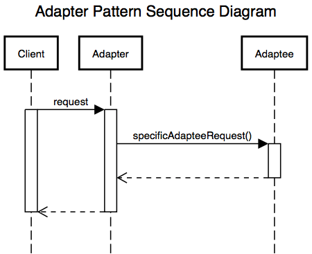
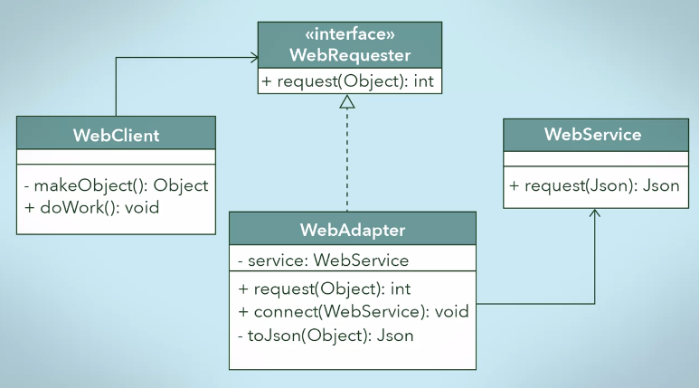

어댑터 패턴


# 어댑터 패턴

어댑터 패턴은 이름대로 어댑터처럼 사용되는 패턴이다. 220V 를 사용하는 한국에서 쓰던 기기들을, 어댑터를 사용하면 110V 를 쓰는곳에 가서도 그대로 쓸 수 있다. 이처럼, 호환성이 없는 인터페이스 때문에 함께 동작할 수 없는 클래스들이 함께 작동하도록 해주는 패턴이 어댑터 패턴이라고 할 수 있겠다. 이를 위해 어댑터 역할을 하는 클래스를 새로 만들어야 한다.

기존에 있는 시스템에 새로운 써드파티 라이브러리가 추가된다던지, 레거시 인터페이스를 새로운 인터페이스로 교체하는 경우에 코드의 재사용성을 높일 수 있는 방법이 어댑터 패턴을 사용하는 것이다.

구조를 보면 아래와 같다.


**Client**
써드파티 라이브러리나 외부시스템을 사용하려는 쪽이다.

**Adaptee**
써드파티 라이브러리나 외부시스템을 의미한다.

**Target Interface**
Adapter 가 구현(implements) 하는 인터페이스이다. 클라이언트는 Target Interface 를 통해 Adaptee 인 써드파티 라이브러리를 사용하게 된다.

**Adapter**
Client 와 Adaptee 중간에서 호환성이 없는 둘을 연결시켜주는 역할을 담당한다. Target Interface 를 구현하며, 클라이언트는 Target Interface 를 통해 어댑터에 요청을 보낸다. 어댑터는 클라이언트의 요청을 Adaptee 가 이해할 수 있는 방법으로 전달하고, 처리는 Adaptee 에서 이루어진다.


# 어댑터 패턴 호출 과정



클라이언트에서는 Target Interface 를 호출하는 것 처럼 보인다. 하지만 클라이언트의 요청을 전달받은 (Target Interface 를 구현한) Adapter 는 자신이 감싸고 있는 Adaptee 에게 실질적인 처리를 위임한다. Adapter 가 Adaptee 를 감싸고 있는 것 때문에 Wrapper 패턴이라고도 불린다.


# 어댑터 패턴 사용예제




시나리오는 다음과 같다.

기존에는 WebClient 에서는 요청에 대한 처리로 doWork() 메소드를 호출하는데, 이 처리는 WebRequester 인터페이스를 구현한 OldWebRequester 에게 위임하도록 되어있다. 이때, WebRequester 인터페이스를 구현한 OldWebRequester 의 requestHandler() 를 호출한다.

하지만 이 OldWebRequester 를 써드파티 라이브러리인 FancyRequester 로 변경해야하는 상황이 생겼다고 가정하자. 이때 어댑터 패턴을 적용하여 기존의 코드와 써드파티 라이브러리 어느쪽도 수정하지 않고 FancyRequester 를 적용할 수 있다.


## WebRequester <Interface>

```java
public interface WebRequester {
    void requestHandler();
}
```

Target Interface 이다. 구현체를 가지지 않고 requestHandler() 메소드에 대한 정의만 되어있다.


## WebClient

```java
public class WebClient {
    private WebRequester webRequester;

    public WebClient(WebRequester webRequester) {
        this.webRequester = webRequester;
    }

    public void doWork() {
        webRequester.requestHandler();
    }
}
```

doWork() 는 WebRequester 인터페이스를 구현한 클래스의 requestHandler() 메소드를 호출하여 동작한다.

## OldWebRequester

```java
public class OldWebRequester implements WebRequester {
    @Override
    public void requestHandler() {
        System.out.println("OldWebRequester is working");
    }
}
```

시나리오상에서, 기존에 사용하고 있던 WebRequester 의 구현클래스로써, WebClient 에서 doWork() 를 호출하면 내부에서 호출되던 녀석이다. 설명의 편의를 위해 작성했을 뿐, 이 예제의 Client 에서는 사용되지 않는다.


## FancyRequester

```java
public class FancyRequester {
    public void fancyRequestHandler() {
        System.out.println("Yay! fancyRequestHandler is called!");
    }
}
```

사용할 써드파티 라이브러리인 FancyRequester 이다. Adaptee 가 되겠다.


## WebAdapter

```java
public class WebAdapter implements WebRequester {
    private FancyRequester fancyRequester;

    public WebAdapter(FancyRequester fancyRequester) {
        this.fancyRequester = fancyRequester;
    }

    @Override
    public void requestHandler() {
        fancyRequester.fancyRequestHandler();
    }
}
```

어댑터를 위와같이 작성해준다.

WebAdapter 는 `Target Interface` 인 `WebRequester` 인터페이스를 구현하고, 인스턴스 생성시 `FancyRequester` 클래스를 주입한다. (FancyRequester 는 보통 또다른 어떤 인터페이스를 구현한 클래스이겠지만, 굳이 또 만들면 이해하기 복잡해지니까 그냥 구현 클래스만 언급했다)

그리고 Target Interface 인 `WebRequester` 인터페이스의 `requestHandler()` 를 구현하는데, 이때 주입시킨 `FancyRequester` 의 `fancyRequestHandler()` 메소드를 호출하도록 만든다.

이렇게 하면 `WebAdapter` 도 `WebRequester` 인터페이스를 구현했으므로, WebRequester 인터페이스의 구현체를 받아 동작하던 `WebClient` 에 `WebAdapter` 를 넘겨줄 수 있고, 기존에 WebClient 에서 `requesterHandler()` 메소드를 호출하던 코드는 그대로 두면서도, WebAdapter 의 `requestHandler()` 를 통해 써드파티 라이브러리인 `FancyRequester` 를 사용할 수 있게 된다.


## main

```java
public class AdapterDemo {
    public static void main(String[] args) {
        WebAdapter adapter = new WebAdapter(new FancyRequester());
        WebClient client = new WebClient(adapter);
        client.doWork();
    }
}
```


# JDK에 사용된 어댑터 패턴

어댑터 패턴이 적용된 가장 대표적인 예가 자바의 `InputStreamReader` 이다. 콘솔에서 입력을 받을 때 아래와 같이 사용하는 것을 본 적이 있을 것이다. (알고리즘 문제풀때 자바로 하면 Scanner 클래스를 사용하지 않고 이렇게 많이 했던 것 같다)

```java
BufferedReader br = new BufferedReader(new InputStreamReader(System.in));
```

`BufferedReader` 클래스를 까서 위 구문이 실행될때 사용되는 생성자를 보면 아래와 같이 Reader 타입을 받는다.

```java
public BufferedReader(Reader in) {
    this(in, defaultCharBufferSize);
}
```

하지만 `System.in` 은` InputStream` 타입을 반환한다.

```java
public final static InputStream in = null;
```

자바의 `InputStream` 은 바이트 스트림을 읽어들인다. 하지만,` BufferedReader` 는 캐릭터인풋 스트림을 읽어들인다. 둘은 호환되지 않는다. 하지만, 이 둘을 연결시켜 주는 어댑터가 `InputStreamReader` 클래스이다. UML 로 보면 아래와 같은 구조다.


`BufferedReader` 클래스는 `Reader` 클래스를 상속받는다. (Reader 클래스는 Readable 인터페이스를 구현한 추상클래스이다), `InputStreamReader `클래스도 Reader 클래스를 상속받는다. 둘 다` Reader `클래스의 서브클래스 이므로` Reader `타입으로 레퍼런스 할 수 있다.

그리고 `InputStreamReader` 클래스는 InputStream 타입을 받을 수 있는 생성자를 가지고 있으므로, `System.in` 을 `InputStreamReader` 인스턴스 생성시 넘겨주는 방식이다.

`InputStreamReader` 클래스를 **Adapter,** `System.in` 을 **Adaptee**, `Reader` 를 **Target Interface** 라고 할 수 있겠다.